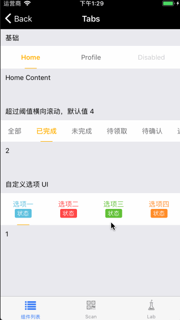

# Tab

标签页组件。

## Install

```
npm install @mfe/beeshell --registry=http://r.npm.sankuai.com
```

## Usage

### 引入方式
#### 全部引入
```
import { Tab } from '@mfe/beeshell';
```

#### 单独引入
```
import Tab from '@mfe/beeshell/components/Tab';
```

### Examples



### Code

```jsx
import { Tab } from '@mfe/beeshell';

class App extends React.Component {
    constructor(props) {
        super(props);
        this.state = {
            value: 1,
        };
    }
    render() {
        const options = [
            {
                value: 1,
                label: '全部',
            },
            {
                value: 2,
                label: '已完成',
            },
            {
                value: 3,
                label: '未完成',
            }
        ];

        return (
             <View>
                <Tab
                    value={this.state.value}
                    options={options}
                    onChange={value => this.setState({ value })}
                />
                <View>
                    <Text>
                        {this.state.value}
                    </Text>
                </View>
            </View>
        );
    }
}


```

### Props

| Name | Type | Required | Default | Description |
| ---- | ---- | ---- | ---- | ---- |
| threshold | Number | false | 4 | 阈值，超过该值则横向滚动 |
| options | Array | true | [] | 数据源，数组中项为对象 <br> `{label: 'xx', value: 'zz'}` |
| label（options 中的对象的属性） | String/ReactElement | true | null | 数据源数组中的对象的属性，用于展示选项，可以是字符串或者 React 组件 |
| value（options 中的对象的属性） | Any | true | null | 数据源数组中的对象的属性，通过该属性判读是否选中该项 |
| value | Any | false | null | 对应数据源对象的 value 值 |
| onChange | Function | false | null | 状态切换时的回调 |
